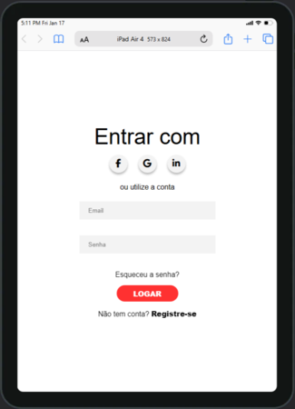
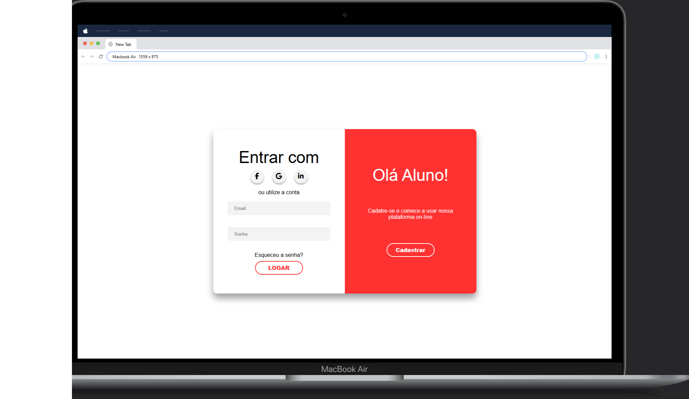

# Page login

Página de login desenvolvida  através do Canal do Fernando Leonid no YouTube.
Na página há vários layouts onde o usuário pode fazer o login ou cadastro. Caso o usuário clique no botão Cadastrar o layout muda para que o usuário possa fazer o cadastro, onde é pedido o e-mail, nome e senha. Caso o usuário aperte o botão entrar o layout muda novamente para que o usuário posso digitar seu usuário e senha para entrar na plataforma.
## Layout
### Mobile

### IPad

### Desktop

## Desafio 💻
O desafio desse projeto seria inicialmente praticar o HTML e aprender mais sobre CSS. 
Após o termino do laout da página decidi acrescentar as validações dos Tags de Input. Na página de cadastro com a validação do e-mail com os caractéres permitidos e deve ter uma padrão com @ e . (ponto) em sua respectivas ordens (carla_gmail.com). Caso falte algum caractér aparece uma mmensagem de "E-mail invalido" e o campo ficará na cor vermelha, se for digitado com os padrões necessários aparecerá uma mensagem "E-mail válido" e o campo ficará verde.
Os campos de nome e senha também são validados com "* Campo obrigatório" e bordas vermelhas caso o campo não seja preenchido e ficará verde se o usuário preencher o campo.
Na página de login os campos também são validados caso não seja preenchido, ou se for preenchido comm informações diferentes do cadastro  aparecerá a mensagem "Login ou senha incorreto".
Se for prreenchido corretamente e for igual as informações de cadastro, o usuário será direcionado para uma página, onde o usuário é parabenizado por ter se tornado aluno.
Com responsividade o layout da página muda se for acessado por um dispositivo mobile.

## Page

## Tecnologias utilizadas 

